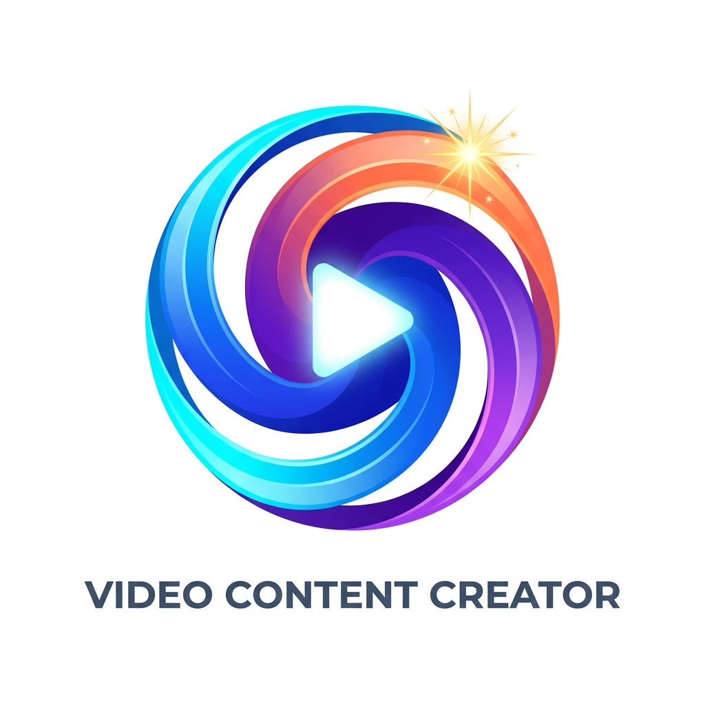

<div align="center">
  
  <h1>Video Content Creator</h1>
  <p><strong>Capture | Create | Inspire</strong></p>
  <p>An end-to-end AI-powered video production studio for ideating viral concepts, planning shoot schedules, extracting and synchronizing captions, analyzing silent B-roll footage, and packaging multi-platform social media posts.</p>
</div>

---

## 🚀 Overview

**Video Content Creator** streamlines the complete video lifecycle from raw idea to published social posts. Built with Angular 21 (Zoneless, Signals), Tailwind CSS v4, and the Google Gemini API (`@google/genai`), the studio guides creators through a focused 4-step workflow:

```
┌──────────────┐     ┌──────────────┐     ┌──────────────────────┐     ┌─────────────────────┐
│  1. Ideas    │ ──> │ 2. Schedule  │ ──> │ 3. Video & Captions  │ ──> │ 4. Social Posts     │
│  Viral Hooks │     │ Scene Blocks │     │ Subtitles or B-Roll  │     │ TikTok, LinkedIn,   │
│  & Concepts  │     │ & Call Sheets│     │ Multimodal Vision    │     │ X / Twitter, FB     │
└──────────────┘     └──────────────┘     └──────────────────────┘     └─────────────────────┘
```

---

## ✨ Key Features

### 💡 1. Creative Ideation & Viral Concept Generation
- **Target Audience & Niche Customization**: Tailor content for Tech & Dev, Lifestyle & Vlogs, Business & Finance, Education & Tutorials, Comedy, Fitness, and more.
- **Hook Optimization**: Generate thumb-stopping opening hooks ranked by viral potential and engagement style (Controversial, Curiosity Gap, Story Hook, Question Hook).
- **Format Flexibility**: Supports Short-form (TikTok, Shorts, Reels) and Long-form (YouTube, Explainer, Podcast clips) video structures.
- **Complete Storyboards**: Scene-by-scene blueprints including spoken scripts, on-screen text, audio suggestions, and visual prompts.

### 📅 2. Shoot Schedules & Production Call Sheets
- **Structured Shot Planning**: Automatic shot lists detailing shot types (Wide, Medium, Close-up, POV, Overhead), camera angles, movement, lighting setups, and required gear.
- **Location & Duration Estimates**: Estimated shooting durations per take with location and props checklists.
- **Exportable Call Sheets**: One-click printable view and direct transfer into the Video & Captions step.

### 🎬 3. Video Captions & Silent B-Roll Visual Analysis
- **Dual-Mode Video Engine**:
  - **Speech-to-Text Subtitles**: Upload recorded video (`MP4`, `WebM`, `MOV`) or audio (`MP3`, `WAV`) to extract synchronized timestamps using browser-native Web Audio and Gemini AI transcription.
  - **Silent / B-Roll Visual Scene Analysis**: When videos have no speech (cinematic montages, product showcases, aesthetic b-roll), browser-native HTML5 Canvas extracts keyframes for Gemini Vision analysis.
- **Multimodal Visual Intelligence**: Detects visual actions, camera movements, aesthetic mood, sound design & background music vibes, and provides a generated voiceover script matching the visual cadence.
- **Interactive Caption Studio**:
  - Live video preview with interactive subtitle overlay and karaoke-style timing highlight.
  - Custom subtitle styles (Classic, TikTok Pop, Minimal, Cinematic Box).
  - Multi-format exports: `.srt` (SubRip), `.vtt` (WebVTT), and `.txt` transcript.

### 📱 4. Multi-Platform Social Media Distribution
- **Platform-Tailored Copy**:
  - **TikTok**: High-converting hook, 3–5 trending niche hashtags, on-screen text directions, and engagement-boosting call-to-actions.
  - **LinkedIn**: Thought leadership formatting, structured bullet points, professional storytelling, and conversational sign-offs.
  - **Twitter / X**: Standalone viral hooks or multi-tweet thread breakdown with real-time character limit validation.
  - **Facebook**: Warm, conversational storytelling optimized for community comments, shares, and reactions.
- **One-Click Actions**: Quick copy buttons, platform-specific formatting previews, and character counters.

### 💾 5. Studio Library & Local Persistence
- Save high-performing ideas, generated shoot schedules, and social packages locally in the browser for future reference.
- Built-in demo data to test and explore the entire studio workflow instantly without needing to upload files or enter prompts.

---

## 🛠️ Tech Stack

- **Frontend Framework**: [Angular 21](https://angular.dev/) (Zoneless change detection, Signals, Standalone components)
- **UI & Icons**: [Angular Material](https://material.angular.io/) icons (`@angular/material/icon`), [Tailwind CSS v4](https://tailwindcss.com/)
- **Animation**: [Motion](https://motion.dev/)
- **Backend & SSR**: [Express 5](https://expressjs.com/) with Vite SSR middleware
- **AI & Multimodal Vision**: [Google Gen AI SDK](https://github.com/google-gemini/generative-ai-js) (`@google/genai`) powered by Gemini 2.5 models
- **Audio & Media**: Browser Web Audio API (`AudioContext`), HTML5 Canvas frame extraction, SubRip & WebVTT parsers

---

## 📦 Getting Started

### Prerequisites
- **Node.js**: v20.x or later
- **npm**: v10.x or later
- **Gemini API Key**: Obtain from [Google AI Studio](https://aistudio.google.com/)

### Installation

1. **Clone the repository**:
   ```bash
   git clone <repository-url>
   cd video-content-creator
   ```

2. **Install dependencies**:
   ```bash
   npm install
   ```

3. **Configure Environment Variables**:
   Create a `.env` or `.env.local` file at the root:
   ```env
   GEMINI_API_KEY=your_actual_gemini_api_key_here
   ```

4. **Start the Development Server**:
   ```bash
   npm run dev
   ```
   The application will start on `http://localhost:3000`.

---

## 📜 Available Scripts

| Command | Description |
| :--- | :--- |
| `npm run dev` | Starts the Angular + Express dev server on port `3000` |
| `npm run build` | Compiles the production build (client and SSR bundle) |
| `npm run lint` | Runs ESLint and Angular linter checks |
| `npm run test` | Executes unit tests with Vitest |
| `npm run serve:ssr:app` | Runs the compiled server-side rendered application |

---

## 📄 License

This project is built and maintained with Google AI Studio. Distributed under the MIT License.

